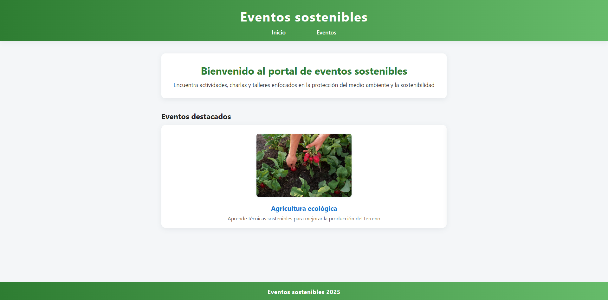

# Eventos Sostenibles

**Portal de eventos sostenibles con frontend y backend básico**

Proyecto realizado en 1ºDAW.

## 🌱 Objetivos del proyecto

- Facilitar la organización y gestión de eventos sostenibles.
- Promover prácticas responsables con el medio ambiente mediante, concienciando a la gente por medio de actividades y charlas ecológicas.
- Proporcionar conocimientos que apoyen la sostenibilidad en diversos sectores.

## 🛠️ Tecnologías usadas

- **Frontend:** HTML, CSS, JavaScript
- **Backend:** Java
- **Base de Datos:** SQL
- **Servidor:** XAMPP

## 📁 Estructura del proyecto

eventos-sostenibles/
├── doc/ # Documentación del proyecto
├── html/ # Frontend
├── java/ # Lógica del backend
├── sql/ # Scripts para la base de datos y su modelo relacional. Modelo entidad relación disponible en drawio
├── grafo_ramas_git.jpg # Imagen del grafo de ramas en Git
└──  portal_eventos_sostenibles.jpg # Captura del portal

## Preview frontend

